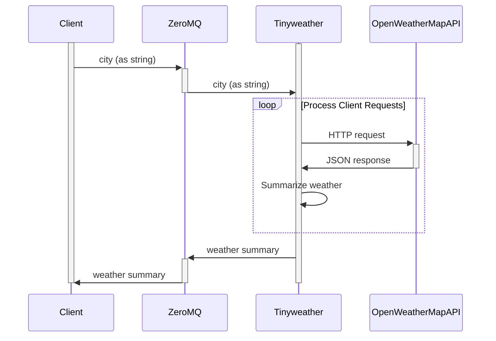

# Tinyweather
A tiny microservice for getting weather information.


## Setup
1. Create an OpenWeatherMap account at https://home.openweathermap.org/users/sign_up.
1. Go to your account page to [get your API key](https://home.openweathermap.org/api_keys).
1. Enter your API key in the `tinyweather.py` file.
1. Run the `tinyweather.py` service locally.


## Requesting Weather Data
1. Create a ZeroMQ socket on the same port number used by the tinyweather service.
1. On that socket, send the name of a city for which to get the current weather (as a string).

```python
import zmq

# Configure options.
PORT_NUMBER = 5555
city = "Las Vegas"

# Open socket.
print("Connecting to server...")
context = zmq.Context()
socket = context.socket(zmq.REQ)
socket.connect(f'tcp://localhost:{PORT_NUMBER}')

# Send request.
print(f"Sending request: {city}")
socket.send_string(city)
```

_(See the `request.py` file for a full example.)_

## Receiving Weather Data
After sending a request to the tinyweather service, listen for a weather summary on the same socket.

```python
# Get response.
response = socket.recv_json()
print(f"Received response: {response}\n")
```

The weather summary will be returned as a JSON object having the following format:

```json
{
"city": "Las Vegas",
"is_day": true/false,
"is_raining": true/false
}
```

If no weather information is available for the specified city, tinyweather returns an empty JSON object.

_(See the `request.py` file for a full example.)_


## UML Sequence Diagram

